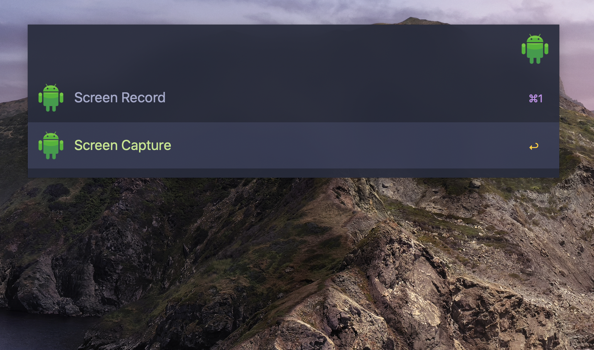

# alfred-adb

Alfred workflow that capture & record screen for Android device via adb tool

The alert windows are token from [https://github.com/xiaozhuai/macos-alert](https://github.com/xiaozhuai/macos-alert) (A tool to show a alert windows in shell scripts on MacOS.)

# preview

